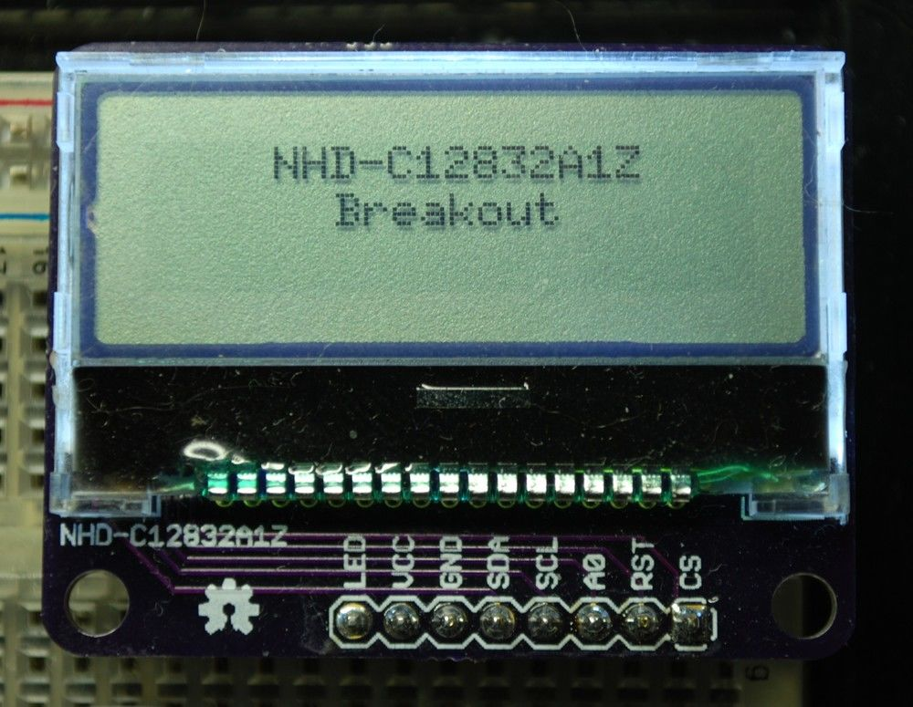
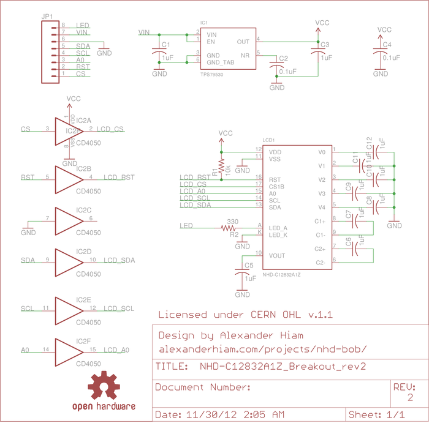

<!--
 This is the source for the documentation PDF.
 PDF is generated using Gimli (https://github.com/walle/gimli).

 To generate PDF:
  $ cd NHD-C12832A1Z_Breakout/src
  $ gimli -s NHD-C12832A1Z_Breakout.css -o ../
-->

# NHD-C12832A1Z Breakout
### A breakout board for  Newhaven Display's [NHD-C12832A1Z series](http://www.digikey.com/scripts/DkSearch/dksus.dll?vendor=0&keywords=NHD-C12832A1Z)
#### Revision 2
---

<div class="br1"></div>
<div class="center">

</div>

<div class="br1"></div>
<div class="br1"></div>

### -[http://alexanderhiam.com/projects/nhd-bob/](http://alexanderhiam.com/projects/nhd-bob/)
### -[https://github.com/alexanderhiam/NHD-C12832A1Z_Breakout](https://github.com/alexanderhiam/NHD-C12832A1Z_Breakout)

<div class="br1"></div>
<div class="center">
<div class="license">
<b>Copyright © 2012 - Alexander Hiam - ahiam@marlboro.edu</b> <br />
This documentation describes Open Hardware and is licensed
under the CERN OHL v. 1.1.
You may redistribute and modify this documentation under the
terms of the CERN OHL v.1.1 (<a href="http://ohwr.org/cernohl">
http://ohwr.org/cernohl</a>). This documentation is distributed 
WITHOUT ANY EXPRESS OR IMPLIED WARRANTY, INCLUDING OF MERCHANTABILITY, 
SATISFACTORY QUALITY AND FITNESS FOR A PARTICULAR PURPOSE. Please see
the CERN OHL v.1.1 for applicable conditions.
</div>
</div>

<div class="page-break"></div>

<div class="br2"></div>

## Description 

The NHD-C12832A1Z Breakout includes a [TPS79530](http://www.ti.com/product/tps79530) fixed 3V 500mA low-dropout linear regulator to generate the supply voltage for the LCD. The TPS79530 has a rated maximum dropout voltage of 170mV and a maximum input voltage of 5.5V, so the board can be powered by either a 3.3V or 5V supply (or really anything in the range of 3.17V-5.5V). The supply should be able to source up to at least 450mA, as this is the rated maximum current draw for the LCD. 

Also included on the board is a [CD4050](http://www.digikey.com/product-detail/en/CD4050BDR/296-31503-1-ND/3505786) buffer, which is used to shift the SPI signals from the input level of 3.3V or 5V to the LCD's 3V level. 

The board includes all external components required by the display, including a 10KΩ pull-up resistor on the reset line, and a 330Ω current limiting resistor in series with the backlight LEDs.

<div class="br2"></div>

## Using the NHD-C12832A1Z Breakout

The NHD-C12832A1Z series displays use a ST7565R controller. While not official supported, it can be controlled using the [dogm128](http://code.google.com/p/dogm128/) library, which can be used with Arduino as well as an assortment of other AVR microcontrollers. To use the dogm library, follow the [installation instructions](http://code.google.com/p/dogm128/wiki/install) and set the display driver to DOGM132 in step 5. Then in your Arduino sketch, set the display contrast to around 8-10, e.g.:

```cpp
#include <Dogm.h>

Dogm dogm(a0_pin);

void setup() {
  dogm.setContrast(0x8);
  ...
```

The dogm128 library has been rewritten and renamed to [u8glib](http://code.google.com/p/u8glib/), but the NHD-C12832A1Z no longer works, as the setContrast() method is disabled for the DOGM132 driver. 

<div class="br2"></div>

NHD-C12832A1Z Breakout will be available for purchase on [Tindie](https://tindie.com/) soon.

<div class="page-break"></div>

<div class="br2"></div>

## Schematic

<div class="br2"></div>




